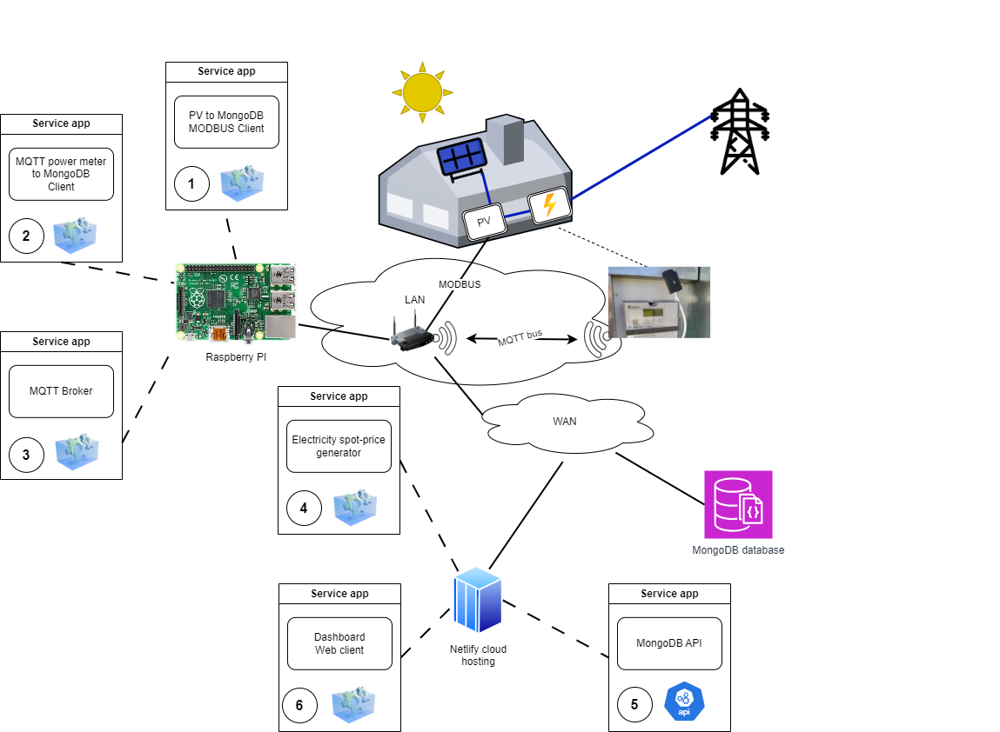

# Solar and grid power monitoring overview
## Introduction
This github repo holds the documentation files for a solar and grid power monitoring project. The project is about realtime monitoring (granuality of one hour) of the produced solar power as well as monitoring the imported and exported power values.<br/>

MongoDb serves as the database for the whole project. Currently, running on a free-plan account, hosted by MongoDB Atlas Cloud Service.<br/>

Some of the applications are hosted on yet another free-plan account by Netlify Cloud Services. While a few other applications are running on a Raspberry Pi. Mostly becasue these need to be within close proximity to the power sensors that are harvesting the realtime data.<br/>

## Prerequisite
All services are written in Javascript, so nodejs is a most. We also need an MQTT message broker on the LAN. See the HW chapter below as it also describes how to get started with raspberry Pi.

## Overview
The picture says it all :-)


## Applications/Services 

### 1) MODBUS aplication for collecting solar power data
The company (Svea Solar) that installed the solar panels refused to share an API key to the fusion solar service for fetching the production data as they had no more keys to share. It would have been the most smooth solution. They also refused to grant me installer rights so that I might enable the modbus on the PV dongle. But, they did enable it for me. That done, this app was born for fetching power values by periodically reading two registers from the convereter and storing them in the MongoDb database.<br/>
ToDo: Add link to the github repo for this app!

### 2) MQTT client collecting power data to/from the grid
This is an MQTT client listening to messages sent from the P1Ib power meter. MQTT on P1IB device is disabled by default, so one needs to go to settings and configure it. Check out the two links below for more info on the P1IB device. 
[Link to P1IB github repo](https://github.com/remne/p1ib)
[Link to Remnetech, the offical site of P1IB](https://remne.tech/)

ToDo: Add link to the github repo for this app!

### 3) MGTT broker/bus on the LAN
Installed Mosquitto MQTT broker on Raspberry Pi, which is an open source and lightweight message broker implementing MQTT protocol. To read more about it, [go to mosquitto.org](https://mosquitto.org/)
Here are the steps to get it running on a Rapsberry Pi:
```
  First, update the Raspberry Pi system software:
    sudo apt update && sudo apt upgrade
  
  Install the Mosquitto MQTT broker and the client applications (subscriber/publisher) for testing/experimenting:
    sudo apt install -y mosquitto mosquitto-clients
  
  Edit the configuration file, like the lines below, then save the changes and close the file:
    sudo nano /etc/mosquitto/mosquitto.conf

    listener 1883
    allow_anonymous false
    password_file /etc/mosquitto/pwdfile
  
  Now create a user & password for the publisher (i.e. P1IB). Enter a password when prompted for it.
    sudo mosquitto_passwd -c /etc/mosquitto/pwdfile <publisher_user>

  Then, add a new user to the /etc/mosquitto/pwdfile with option -b
    sudo mosquitto_passwd -b /etc/mosquitto/pwdfile <subscriber_user> <password>
  
  Restart the server:
    sudo service mosquitto restart

```
Obviously, the publisher is the P1BL device and the subscriber is the MQTT client. [This is the reference site I used for installing the mqtt broker](https://cedalo.com/blog/mqtt-broker-raspberry-pi-installation-guide/)

### 4 Electricity spot prices service

### 5 MongoDb API service

### 6 A web client presenting dashboards

## Hardware

### Solar Power Converter: Huawei SUN2000 series

### Power Meter: P1LB
[Link to P1IB github repo](https://github.com/remne/p1ib)
[Link to Remnetech, the offical site of P1IB](https://remne.tech/)

### Raspberry Pi
The Raspberry Pi used in this project is version 1, model B (I think). Since it is a relic, it is running desktopless.

Tip: To toggle between desktopp and shell login:
```
  sudo raspberry-config

  Then navigate:
  1 system Options -> S5 Boot/Auto Login
  Finish -> reboot
```

Install NodeJS:
```
  cd ~
  wget https://unofficial-builds.nodejs.org/download/release/v20.7.0/node-v20.7.0-linux-armv6l.tar.gz
  tar -xzf node-v20.7.0-linux-armv6l.tar.gz
  cd node-v20.7.0-linux-armv6l
  sudo cp -R * /usr/local
```

Install Java JDK 11. Don't really remember if it is a prereq, but it might be good to have:
```
  cd /usr/lib/jvmsudo wget https://cdn.azul.com/zulu-embedded/bin/zulu11.41.75-ca-jdk11.0.8-linux_aarch32hf.tar.gz
  sudo tar -xzvf zulu11.41.75-ca-jdk11.0.8-linux_aarch32hf.tar.gz
  sudo rm zulu11.41.75-ca-jdk11.0.8-linux_aarch32hf.tar.gz
```

Optionally, install Docker. Not used in the project yet...
```
 curl -fsSL https://get.docker.com -o get-docker.sh
  sudo sh get-docker.sh
  sudo docker info
  sudo docker run hello-world
```
## ToDo's

## Refs
